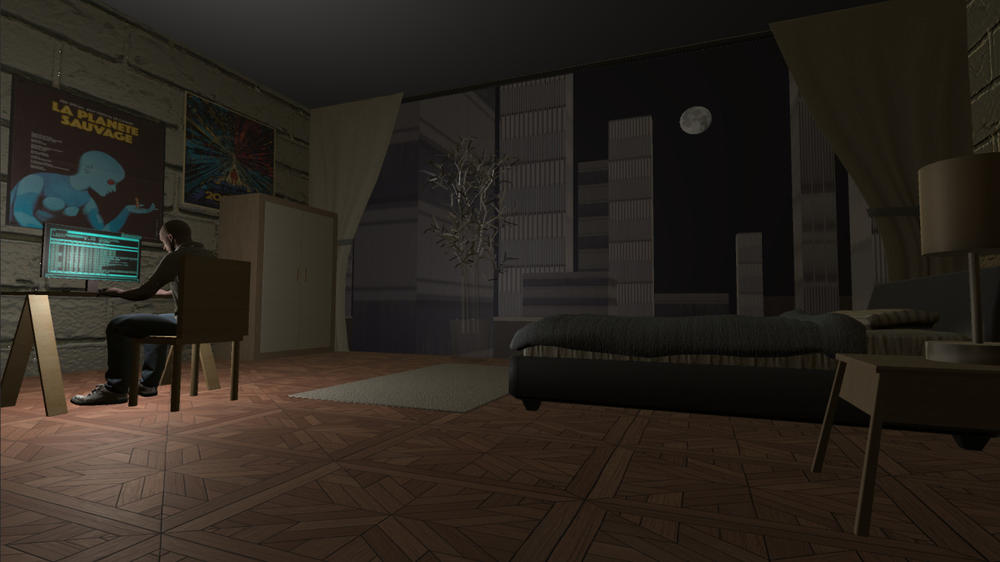
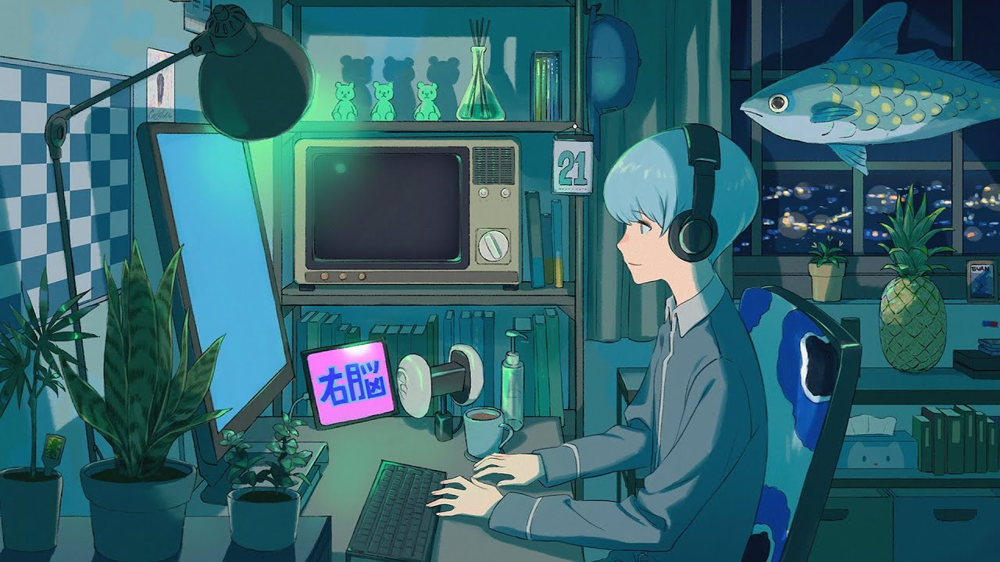

# Scene: Coding Night

Presiona la tecla de espacio en tu teclado para que transcurra el día y la noche. Observa cómo la luz afecta los diferentes objetos en el cuarto conforme pasa el día. :sunny: :crescent_moon:

## Final project for Computer Graphics Course
- Carlos Andrés Conde Besil A01650549
- Diego Montaño Martínez A01651308
- Eric Andrés Jardón Chao A01376748

**Descripción:** Escogimos para nuestra escena la popular imagen de un programador en su cuarto, tranajando en un momento de completa concentración.

## Inspiración
Nos inspiramos en los típicos canales de youtube de música Hip Hop y Lo Fi donde es una playlist larga con un artwork de un programador en su oficina o cuarto. 

La idea es que nosotros utilicemos assets para algunos de los objetos del cuarto (posters, computadora, caja de pizza, asiento, entre otros), y nos dediquemos a modelar el resto (e.g. el programador, la computadora, otros detalles).

Incluimos dos ejemplos para evocar nuestra idea:

- Ejemplo 1

- Ejemplo 2

## Características de la escena

- **Animación**: el protagonista de la escena, el programador, se encuentra sentado frente a su equipo de cómputo. Hace continuamente un movimiento de escritura en el teclado, que se complementa con una sutil inclinación en la cabeza y pies. 

- **Interactividad**: día y noche pasan, nuestro protagonista no deja de trabajar. Por el ventanal entra la luz exterior, es posible ver el amanecer, el atardecer y el anochecer. Entre los edificios pasará el sol y la luna. Basta con que el usuario presione la barra espaciadora para avanzar en el tiempo. El usuario también puede cambiar la tonalidad del cielo entre azul, naranja y púrpura, apretando la tecla `A`.

- **Sombras**: Para el juego de sombras hay múltiples luces en la escena incluyendo la de la pantalla, así como el movimiento del sol y la luna a través del ventanal del cuarto. Es posible observar sombras en todos los objetos. Vale la pena prestar atención a la sombra que producen las hojas de la planta.

- **Objetos propios**: Los siguientes objetos en la escena fueron creados por los miembros del equipo utilizando las formas básicas de Unity. Mesa de trabajo, silla, edificios, lámpara, equipo de cómputo.

- **Créditos**: El resto de los objetos de la escena, incluidos sus materiales, texturas, así como el personaje y su animación fueron recuperados de diversas fuentes incluyendo la tienda de assets de Unity. Los créditos respectivos son para sus creadores que podrán ser consultados en la sección de referencias.

## Referencias

- Mixamo. (2022). Mixamo Characters. Recuperado de: https://www.mixamo.com/#/?page=2&type=Character

- Mixamo. (2022). Mixamo Motion Pack. Recuperado de: https://www.mixamo.com/#/?page=1&type=Motion%2CMotionPack

- Unity Asset Store. (2022). Office Room Furniture. Recuperado de: https://assetstore.unity.com/packages/3d/props/furniture/office-room-furniture-70884

- Unity Asset Store. (2022). Furnished Cabin. Recuperado de: https://assetstore.unity.com/packages/3d/environments/urban/furnished-cabin-71426

- Unity Asset Store. (2022). Wood Pattern Material. Recuperado de: https://assetstore.unity.com/packages/2d/textures-materials/wood/wood-pattern-material-170794

- Unity Asset Store. (2022). High Quality Bricks & Walls. Recuperado de: https://assetstore.unity.com/packages/2d/textures-materials/brick/high-quality-bricks-walls-49581

