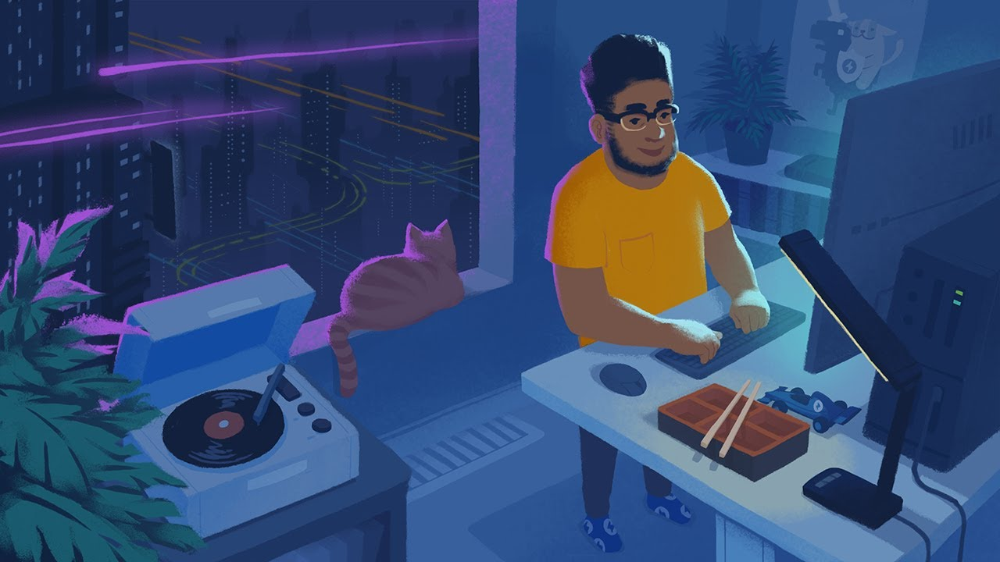

# Scene: Coding Night
Final project for Computer Graphics Course
- Carlos Andrés Conde Besil A01650549
- Diego Montaño Martínez A01651308
- Eric Andrés Jardón Chao A01376748

**Descripción:** Éscogimos para nuestra escena la popular imagen de un programador en su cuarto escuchando música y en un momento de completa concentración.

### Inspiración
Nos inspiramos en los típicos canales de youtube de música Hip Hop y Lo Fi donde es una playlist larga con un artwork de un programador en su oficina o cuarto. 

La idea es que nosotros utilicemos assets para algunos de los objetos del cuarto (posters, computadora, caja de pizza, asiento, entre otros), y nos dediquemos a modelar el resto (e.g. el programador, la computadora, otros detalles).

Incluimos dos ejemplos para evocar nuestra idea:

- Ejemplo 1

- Ejemplo 2

## Características de la escena

Para la animación de nuestra escena estamos contemplando varios escenarios:
- **Interactividad**: queremos que la escena sea interactiva; por lo que nuestra idea es que usuario al apretar teclas pueda hacer que nuestro programador protagonista en la escena haga un movimiento de programar en el teclado.
- **Sombras y luces** Para jugar con el sombreado estamos contemplando usar múltiples luces en el cuarto incluyendo las de la pantalla (sería un cuarto principalemnte oscuro), o también el movimiento del sol o la luna a través del ventanal del cuarto, con lo cual habría un juego de sombras y de luces.

